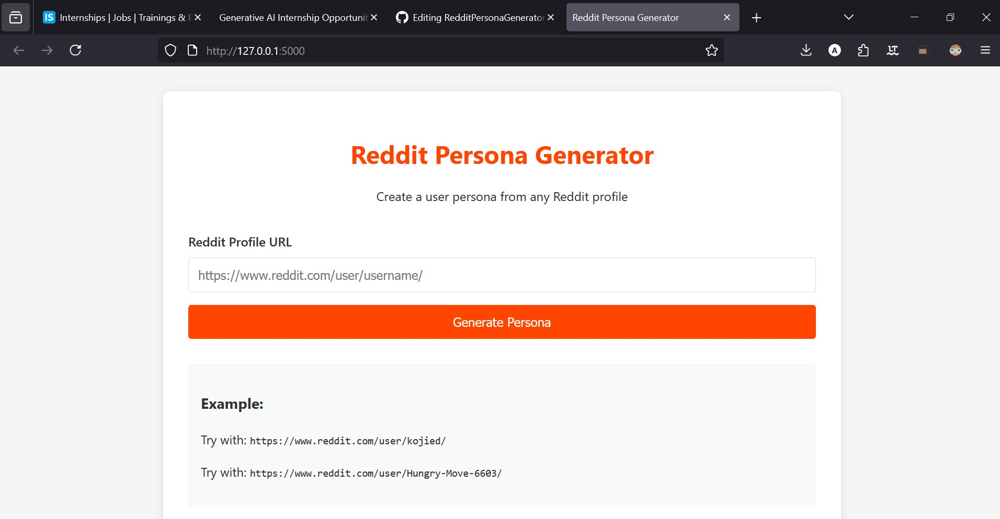
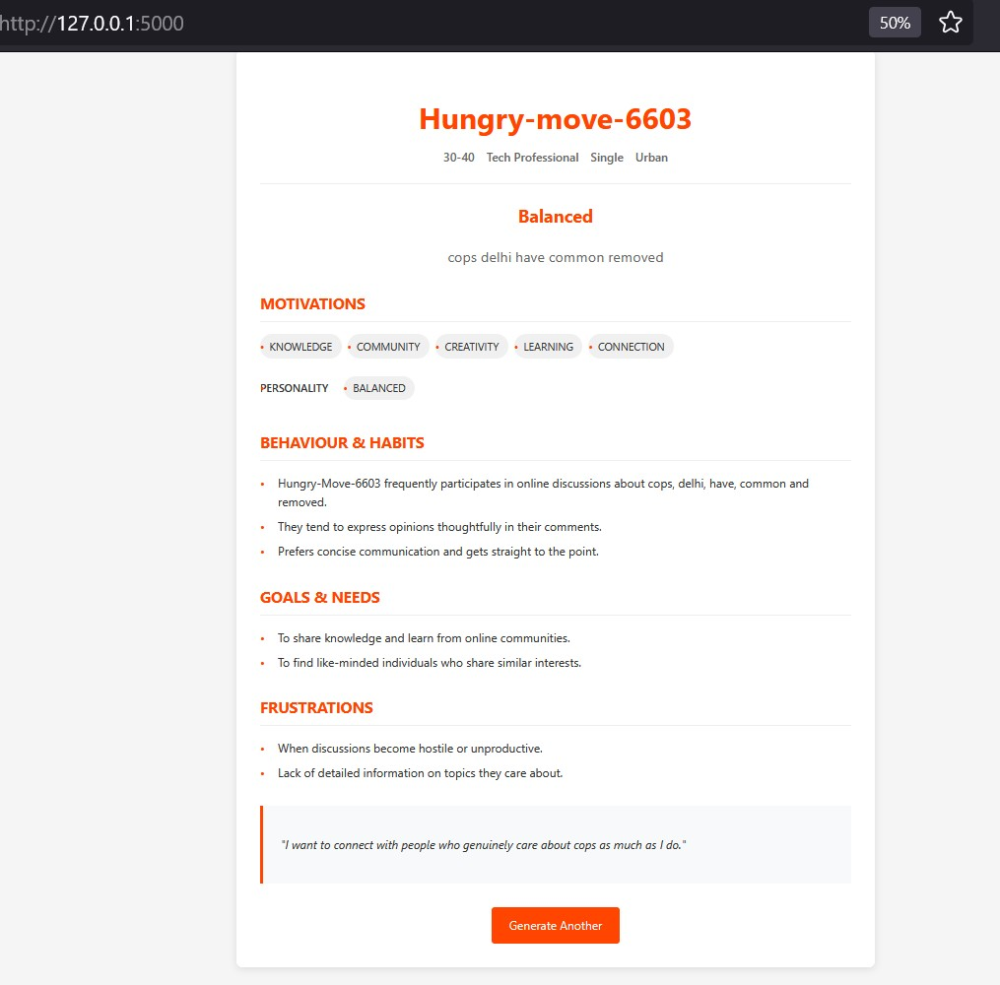

# Reddit Persona Generator 

A Flask web application that scrapes a Reddit user's posts and comments and generates a creative persona profile based on their online activity. Perfect for analyzing public profiles or generating quirky character studies!

##  Features

-  Scrapes public Reddit posts and comments from a given username.
-  Generates a unique "persona" text using pre-defined LLM Logic.
-  Stylish HTML template with a background for better UX.
-  Built with Flask for lightweight deployment.

### Prerequisites

- Python 3.8+
- pip (Python package manager)
---

##  Screenshots

###  Home Page



###  Persona Output



---

##  Installation

```bash
git clone https://github.com/AtulSisodiya/reddit-persona-generator.git
cd reddit-persona-generator
pip install -r requirements.txt
python app.py
